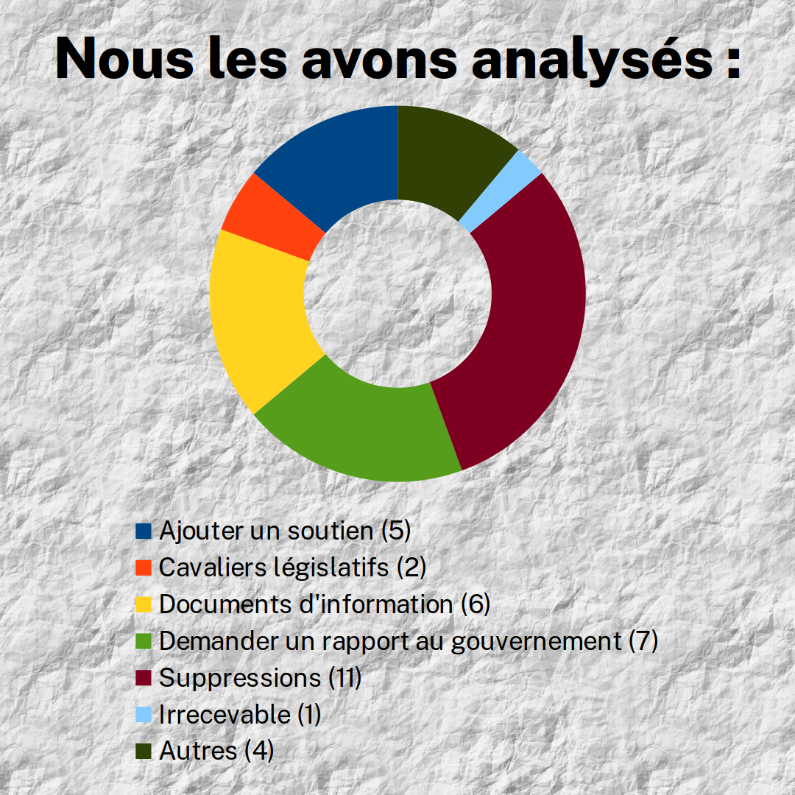

_Publication: 27 novembre 2024_

# Contexte

Le jeudi 28 novembre 2024 était la niche parlementaire de LFI. Les députés ont
proposé d’abroger la retraite à 64 ans. Mais les députés du «socle commun»
(droite), ont posé 771 amendements pour empêcher le vote. Nous avons examiné
tous ceux de Valérie BAZIN-MALGRAS (LR) députés de la deuxième circonscription
de l’Aube.

# Amendements

|  ID |        type        | desc                             |
| --: | :----------------: | -------------------------------- |
| 146 |      rapport       | rachats trimestre                |
| 147 |      rapport       | sécu 2021 + assos                |
| 148 |                    | 4 trimestres sapeur pompier      |
| 149 |      rapport       | régimes maternité?               |
| 150 |      rapport       | harmonisation régime réversion   |
| 151 | cavalier + rapport | handicap                         |
| 152 |      rapport       | proche aidant droit R            |
| 173 |      soutien       | natalité + famille               |
| 177 |      soutien       | jeunes                           |
| 178 |                    | ajout étranger                   |
| 179 |                    | stabilité                        |
| 180 |    irrecevable     |                                  |
| 181 |      rapport       | 2016 emploie retraite            |
| 182 |      rapport       | retraite progressive             |
| 183 |      cavalier      | add sur art L. 521‑1             |
| 184 |      soutien       | natalité par politique familiale |
| 185 |      soutien       | pension réversion                |
| 186 |      soutien       | sénior                           |
| 198 |    suppression     | art 1 *                          |
| 202 |    suppression     | art 2 // tabac                   |
| 207 |    suppression     | art 3                            |
| 215 |                    | ajout                            |
| 216 |        info        | rachats trimestre                |
| 219 |        info        | maternité et édu                 |
| 220 |        info        | pensions et réversion            |
| 221 |        info        | proche aidant                    |
| 258 |        info        | handicapé                        |
| 260 |        info        | retraite progressive             |
| 283 |    suppression     | art1 alinéas 1 à 37 *            |
| 304 |    suppression     | art1 alinéas 38 à 40 *           |
| 305 |    suppression     | art1 alinéas 41 à 49 *           |
| 306 |    suppression     | art1 alinéas 50 à 62 *           |
| 307 |    suppression     | art1 alinéa 63 *                 |
| 308 |    suppression     | art1 alinéa 80 *                 |
| 310 |    suppression     | art1 alinéa 81 *                 |
| 311 |    suppression     | art1 alinéa 12 *                 |

> *** Correspond à l'ajout de la même justification suivante:**
>
> Cet amendement vise à supprimer les modifications des articles du code de
> l’action sociale et des familles dans leur rédaction issue de la réforme des
> retraites de 2023.
>
> La Droite républicaine a toujours assumé, de Jacques Chirac à Nicolas Sarkozy,
> de réformer les retraites pour sauver notre système par répartition.
>
> Le système de retraite est structurellement déficitaire en raison de
> l’inversion du rapport démographique : le déficit va rapidement se creuser, et
> ce de façon importante. Il s’établirait à 14 milliards en 2030 et 21 milliards
> à l’horizon 2035. Par ailleurs, alors qu’on comptait 3 cotisants pour 1
> retraité en 1970, 2 cotisants pour 1 retraité en 2000 il n’y en a plus qu’1,7
> aujourd’hui.
>
> Nous refusons l’augmentation des cotisations et la diminution des pensions !
> La seule solution, c’était donc de relever l’âge de départ, et de travailler
> plus longtemps, comme le font tous nos partenaires européens. L’impact d’une
> telle abrogation serait considérable pour nos finances publiques et
> aggraverait d’autant plus le déséquilibre des caisses de retraite.
>
> Les députés RN ont annoncé qu’ils voteront la PPL, prouvant que du RN au NFP,
> l’irresponsabilité budgétaire est un point commun. Ils n’apportent aucune
> réponse de fond, structurelle et crédible à la problématique démographique,
> notamment à l’impératif de relancer la natalité.
>
> Cet amendement vise donc à supprimer les modifications des articles du code de
> l’action sociale et des familles dans leur rédaction issue de la réforme des
> retraites de 2023.

|        | type        |
| -----: | ----------- |
|      2 | Cavalier    |
|      6 | Info        |
|      7 | Rapport     |
|      5 | Soutien     |
|     11 | Suppression |
|      1 | Irrecevable |
|      4 | Autre       |
| **36** | **total**   |

# Sources

- <https://lafranceinsoumise.fr/interpellez-bloquer-abrogation-retraite/>
- Et pour les amendements:
  <https://www.assemblee-nationale.fr/dyn/17/amendements/0613/AN/{ID}>
