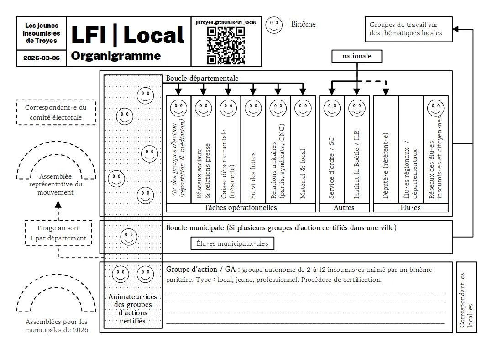

# Liens

[Fichier PDF et de la documentation pour militants](./lfi_local.2026-03.pdf)

# La France insoumise

- [LFI comment ça marche?](https://lafranceinsoumise.fr/lfi-comment-ca-marche/)
- [Les principes de la France insoumise](https://lafranceinsoumise.fr/principes/)
  ou [en PDF format A4](./principes.pdf)
- [Charte des groupes d’action de la France insoumise](https://lafranceinsoumise.fr/groupes-action/charte-groupes-dappui-de-france-insoumise/)
- [Charte des boucles départementales](https://lafranceinsoumise.fr/charte-des-boucles-departementales/)
- [Livret d'accueil](https://infos.actionpopulaire.fr/wp-content/uploads/2024/03/livret-accueil.pdf)
- [Livret de l'animateur](https://materiel.actionpopulaire.fr/wp-content/uploads/2021/07/LIVRET-DES-ANIM_A5_M-V3.pdf)
- [Fiches sur https://infos.actionpopulaire.fr/](https://infos.actionpopulaire.fr/)

## Contre les violences sexistes et sexuelles / VSS

- Collectif Féministe Contre le Viol: 08.00.05.95.95
- [Le Comité de suivi contre les Violences Sexistes et Sexuelles](https://lafranceinsoumise.fr/contacter-le-pole-de-vigilance-et-decoute/):
  contactable par mail: comite-violences-sexistes-sexuelles@lafranceinsoumise.fr

## Sécurité

- **[Livret : Militer en sécurité](https://infos.actionpopulaire.fr/wp-content/uploads/2024/02/Brochure-Militer-en-securite.pdf)**
- L'organisation militante quotidienne
  - Ne jamais militer seul‧e. Ne jamais laisser quelqu’un seul à un étage lors
    d’un porte-à-porte.
  - Identifier le ou la responsable politique.
  - En rentrant chez soi, faire attention à ne pas garder des autocollants ou du
    matériel visible.
  - Toujours écouter et suivre les consignes qui sont données par le service
    d’ordre, qui est là pour assurer la sécurité de tou·tes.
- En cas de problème
  - SE RAPPELER LE CADRE POLITIQUE DE L’ACTION
  - GARDER SON CALME
  - NE PAS RESTER SEUL‧E
  - PRÉVENIR LE RESPONSABLE POLITIQUE DU MOUVEMENT AU PLUS TÔT

# Politique

- [Le programme: l’Avenir en commun / AEC](https://programme.lafranceinsoumise.fr/)
- Pour les municipales 2026
  - 9 garantis programmatiques
  - La boîte à outils programmatique
  - [Les différents outils](https://lafranceinsoumise.fr/2025/04/09/elections-municipales-2026/)
- [Institut la Boétie (stages, conférences, notes, livres)](https://institutlaboetie.fr/)
- [Notre appel pour l’unité populaire (texte politique rédigé lors de l'Assemblée représentative de Juin 2025)](https://lafranceinsoumise.fr/wp-content/uploads/2025/06/TEXTE-AR-JUIN-2025_VF.pdf)
