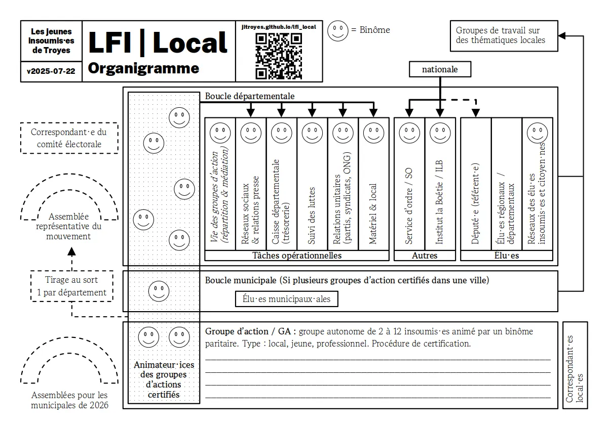

[Fichier PDF, avec le cas de l'Aube et de la documentation pour militants](./2025-07-local.pdf)

# Liens

- [Fonctionnement de LFI](https://lafranceinsoumise.fr/lfi-comment-ca-marche/)
- [Les principes de la France insoumise](https://lafranceinsoumise.fr/principes/)
  ou [en PDF format A4](./principes.pdf)
- [Charte des groupes d’action de la France insoumise](https://lafranceinsoumise.fr/groupes-action/charte-groupes-dappui-de-france-insoumise/)
- [Charte des boucles départementales](https://lafranceinsoumise.fr/charte-des-boucles-departementales/)
- [Le Comité de suivi contre les Violences Sexistes et Sexuelles](https://lafranceinsoumise.fr/contacter-le-pole-de-vigilance-et-decoute/)
