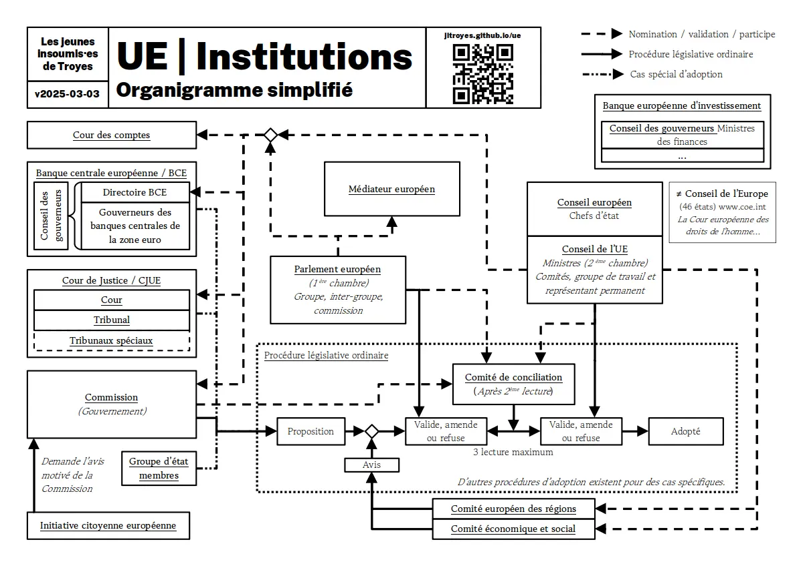

[Organigramme et liste des partis politiques européen en 2024.](./ue.pdf)

# Sources

- [Approbation de la Commission européenne](https://mepwatch.eu/10/vote.html?v=170611)
- [Composition du Parlement européen](https://www.europarl.europa.eu/meps/fr/search/table)
- [Composition de la Commission européenne](https://fr.wikipedia.org/wiki/Commission_von_der_Leyen_II#Coll%C3%A8ge_des_commissaires)

_Et merci à Lucas pour la relecture._
